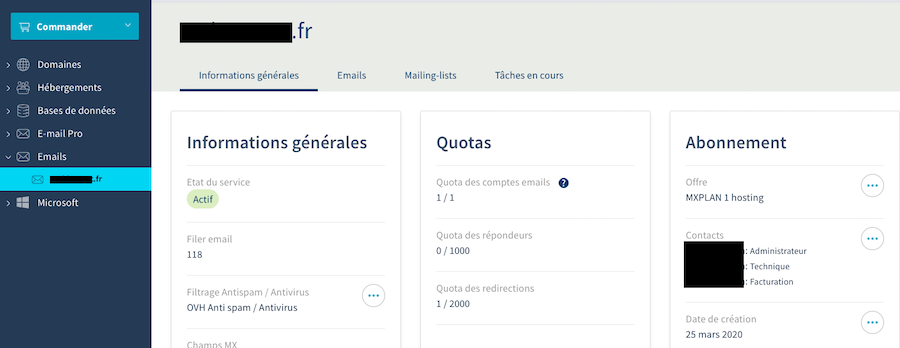
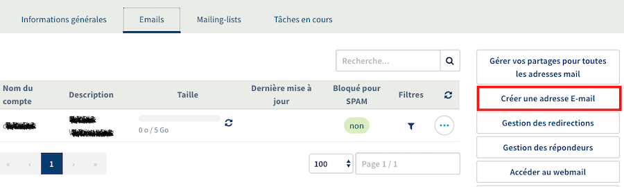
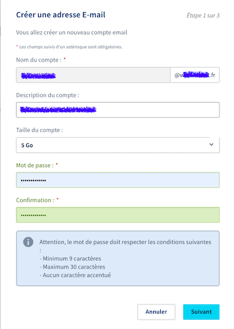
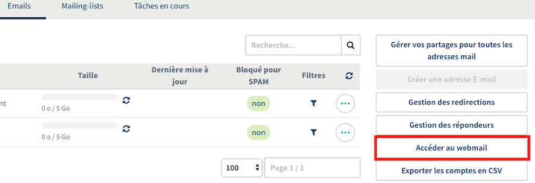
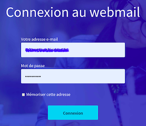

## Créer une adresse mail « pro » reliée au nom de domaine
**Aller sur le compte du nom de domaine, cliquer sur l'onglet _Emails_**

**Dans l’onglet Emails, cliquer sur Créer une adresse E-mail**

**Dans la fenêtre qui s’ouvre, renseigner les champs**

 

**Puis cliquer sur *`Suivant`*, puis *`Suivant`* et enfin *`Valider`* (la dernière étape vous indiquera comment configurer votre boîte mail sur différents appareils et clients mails si vous le souhaitez).**

**Pour accéder à votre boite mail, directement depuis OVH, cliquer sur Accéder au webmail**

**S’identifier sur la page suivante avec l’adresse mail et le mot de passe
À vous de jouer !**
 

> **Attention**
> 
Même si l’adresse mail semble active, il peut falloir entre 30min et quelques heures pour qu’elle soit réellement opérationnelle (envoi et réception de mails)
